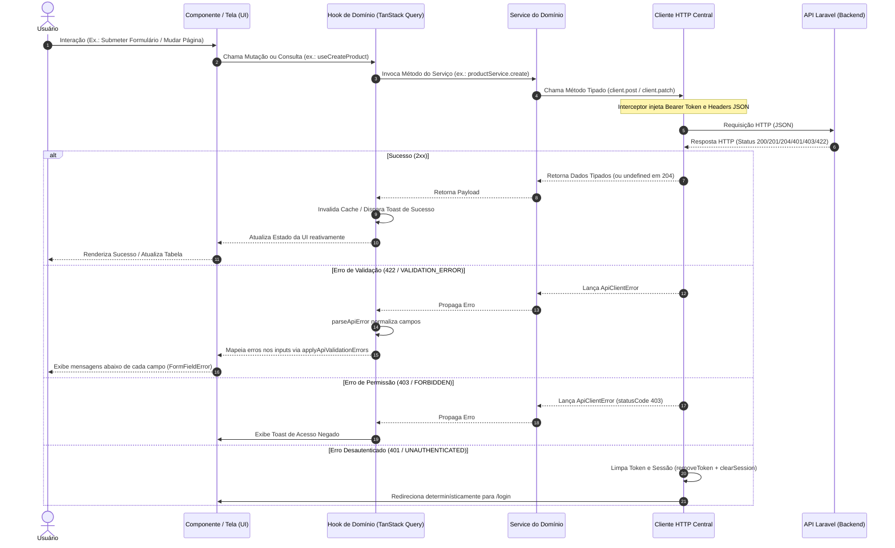
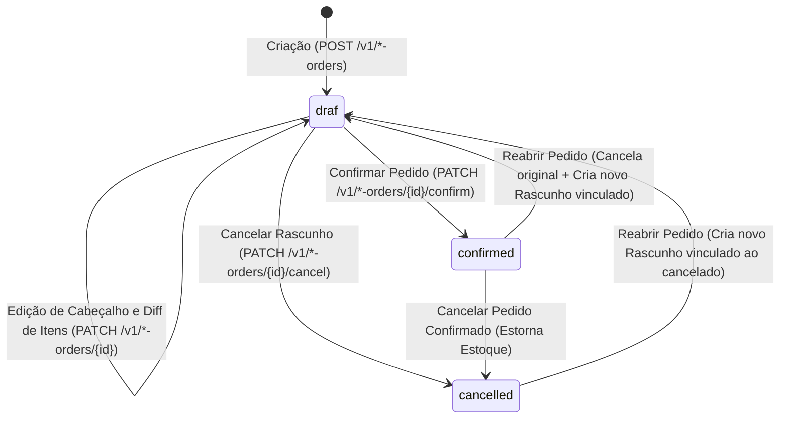

# Arquitetura do Apollo System Frontend

Este documento descreve detalhadamente a arquitetura, convenções, padrões de projeto e fluxos operacionais do frontend do **Apollo System**, construído em Next.js 16 (App Router), React 19, TypeScript e Tailwind CSS v4.

---

## 1. Estrutura de Pastas e Convenções de Nomenclatura

A arquitetura adota o padrão **Feature-Driven (Modular por Domínio)**. Cada domínio de negócio possui seu próprio diretório contendo componentes, hooks, services, schemas e types. Componentes genéricos e infraestrutura técnica residem em diretórios globais agnósticos.

### 1.1. Árvore do Projeto

```text
apollo-react-next/
├── app/                                    # Next.js App Router (Páginas e Roteamento)
│   ├── login/page.tsx                      # Tela pública de autenticação multi-tenant
│   ├── register-organization/page.tsx      # Tela pública de cadastro da organização + admin
│   ├── (dashboard)/                        # Grupo de rotas protegidas por autenticação
│   │   ├── layout.tsx                      # App Shell (Sidebar, Header, proteção de sessão)
│   │   ├── page.tsx                        # Visão geral / Dashboard inicial com KPIs
│   │   ├── products/                       # Rotas de Catálogo de Produtos (/products, /new, /[id])
│   │   ├── brands/                         # Rotas de Marcas (/brands, /new, /[id])
│   │   ├── categories/                     # Rotas de Categorias (/categories, /new, /[id])
│   │   ├── clients/                        # Rotas de Clientes e Endereços (/clients, /new, /[id])
│   │   ├── sellers/                        # Rotas de Vendedores e Endereços (/sellers, /new, /[id])
│   │   ├── suppliers/                      # Rotas de Fornecedores e Endereços (/suppliers, /new, /[id])
│   │   ├── sales-orders/                   # Rotas de Pedidos de Venda (/sales-orders, /new, /[id])
│   │   ├── purchase-orders/                # Rotas de Pedidos de Compra (/purchase-orders, /new, /[id])
│   │   └── users/                          # Rotas de Usuários e Permissões (/users, /new, /[id])
│   ├── layout.tsx                          # Root Layout (Providers de Tema, Cache e Toaster)
│   ├── globals.css                         # Estilos globais e tokens CSS (Tailwind v4)
│   └── not-found.tsx                       # Página 404 personalizada
│
├── components/                             # Componentes de interface agnósticos de domínio
│   ├── ui/                                 # Componentes primitivos shadcn/ui (Button, Card, Table, Dialog, Select, etc.)
│   ├── layout/                             # Componentes estruturais (Sidebar, Header, UserNav)
│   ├── providers/                          # Provedores de contexto (QueryProvider, ThemeProvider)
│   └── common/                             # Componentes visuais e guardas utilitários compartilhados
│       ├── can.tsx                         # Renderização condicional declarativa baseada em permissões (<Can>)
│       ├── permission-guard.tsx            # Proteção de página/bloco com tela de "Acesso Restrito" (<PermissionGuard>)
│       ├── page-header.tsx                 # Cabeçalho padrão de página com título, subtítulo e ações
│       ├── data-table-pagination.tsx       # Paginação padronizada compatível com o envelope da API Laravel
│       ├── empty-state.tsx                 # Estado vazio amigável com ícone, descrição e call-to-action
│       ├── loading-skeleton.tsx            # Skeletons para tabelas, cards e formulários
│       ├── confirm-dialog.tsx              # Modal de confirmação para ações críticas ou destrutivas
│       ├── form-field-error.tsx            # Exibidor padronizado de mensagens de erro por campo
│       └── money-display.tsx               # Renderizador tipado para strings monetárias em BRL
│
├── features/                               # Módulos organizados estritamente por domínio de negócio
│   ├── auth/                               # Domínio: Autenticação, Registro de Organização e Hook usePermissions
│   ├── products/                           # Domínio: Produtos, Preços, Unidades, Categorias e Estoque Inicial
│   ├── brands/                             # Domínio: Marcas de Produtos
│   ├── categories/                         # Domínio: Categorias de Produtos
│   ├── clients/                            # Domínio: Clientes (PF/PJ)
│   ├── sellers/                            # Domínio: Vendedores (PF/PJ) e Comissão
│   ├── suppliers/                          # Domínio: Fornecedores (PF/PJ)
│   ├── sales-orders/                       # Domínio: Pedidos de Venda (Rascunho, Confirmação, Cancelamento, Reabertura)
│   ├── purchase-orders/                    # Domínio: Pedidos de Compra (Rascunho, Confirmação, Cancelamento, Reabertura)
│   ├── addresses/                          # Domínio: Endereços Polimórficos e Base Local IBGE (UF -> Cidade)
│   │   ├── components/                     # AddressList e AddressDialog (seleção em cascata UF -> Cidade)
│   │   ├── data/ibge-locations.json        # Base oficial do IBGE com 27 UFs e 5.570 municípios brasileiros
│   │   ├── utils/locations.ts              # Helpers O(1) de lookup por código IBGE de UF e Município
│   │   ├── hooks/                          # Hooks de mutação de endereços (create, update, delete)
│   │   ├── services/                       # Serviço polimórfico (/v1/{ownerType}/{ownerId}/addresses)
│   │   ├── schemas/                        # Schema Zod de endereço (uf_ibge_code + city_ibge_code)
│   │   └── types/                          # Interfaces AddressResource, CityResource, UfResource
│   └── users/                              # Domínio: Usuários e Matriz de Permissões (RBAC)
│       # Estrutura padrão dentro de cada feature/:
│       ├── components/                     # Componentes visuais específicos da feature (Tabelas, Forms, Dialogs)
│       ├── hooks/                          # Hooks de dados (useQuery/useMutation)
│       ├── services/                       # Funções de chamada à API usando o cliente HTTP
│       ├── schemas/                        # Schemas Zod de validação client-side
│       └── types/                          # Interfaces e tipos TypeScript do domínio
│
├── lib/                                    # Infraestrutura técnica e utilitários agnósticos
│   ├── api/
│   │   ├── client.ts                       # Cliente HTTP tipado sobre fetch nativo com interceptors
│   │   ├── errors.ts                       # parseApiError e applyApiValidationErrors
│   │   └── types.ts                        # Envelopes de resposta (ApiResponse, PaginatedResponse)
│   ├── auth/
│   │   ├── token.ts                        # Leitura e escrita do token Bearer (localStorage e cookies)
│   │   ├── session.ts                      # Persistência e leitura da sessão do usuário logado
│   │   └── permissions.ts                  # Motor de normalização e avaliação de permissões RBAC
│   ├── diff.ts                             # Cálculo determinístico de diff para requisições PATCH
│   ├── formatters.ts                       # Formatadores nativos Intl (Moeda BRL até 4 decimais, Datas pt-BR, Quantidades)
│   ├── masks.ts                            # Máscaras puras em TypeScript (CNPJ alfanumérico, CPF, CEP, Telefone, NCM, Preço, Estoque)
│   └── utils.ts                            # Função `cn` para composição de classes Tailwind CSS
│
├── docs/                                   # Documentação técnica do projeto
│   ├── ARCHITECTURE.md                     # Arquitetura, padrões, segurança e fluxos de engenharia (este arquivo)
│   ├── FEATURES_AND_WORKFLOWS.md           # Guia funcional e técnico detalhado de todos os módulos e fluxos de negócio
│   └── DEPENDENCIES.md                     # Justificativa técnica de todas as dependências e decisões arquiteturais
└── README.md                               # Guia rápido de instalação, credenciais de desenvolvimento e visão geral
```

### 1.2. Convenções de Nomes

* **Arquivos e Pastas**: `kebab-case` (ex.: `sales-orders`, `form-field-error.tsx`, `use-products.ts`).
* **Componentes React**: `PascalCase` (ex.: `DataTablePagination`, `ProductForm`, `PermissionGuard`).
* **Funções e Utilitários**: `camelCase` (ex.: `formatBRL`, `parseApiError`, `calculateDiff`, `getCitiesByUf`).
* **Tipos e Interfaces**: `PascalCase` (ex.: `ProductResource`, `ParsedApiError`, `CityResource`).
* **Constantes e Schemas**: `camelCase` terminando com `Schema` para validadores Zod (ex.: `productSchema`, `loginSchema`, `addressSchema`).

---

## 2. Fluxo de Dados Unidirecional

Nenhum componente de tela realiza chamadas `fetch` diretamente. Os componentes apenas apresentam dados e despacham eventos de interface. Toda a lógica de requisição, cache e mutação é orquestrada por **Hooks**, que utilizam **Services**, que por sua vez utilizam o **Cliente HTTP central**.

### Diagrama de Fluxo de Dados (Mermaid)


```mermaid
sequenceDiagram
    autonumber
    actor Usuario as Usuário
    participant Componente as Componente / Tela (UI)
    participant Hook as Hook de Domínio (TanStack Query)
    participant Service as Service do Domínio
    participant Client as Cliente HTTP Central
    participant Backend as API Laravel (Backend)

    Usuario->>Componente: Interação (Ex.: Submeter Formulário / Mudar Página)
    Componente->>Hook: Chama Mutação ou Consulta (ex.: useCreateProduct)
    Hook->>Service: Invoca Método do Serviço (ex.: productService.create)
    Service->>Client: Chama Método Tipado (client.post / client.patch)
    Note over Client: Interceptor injeta Bearer Token e Headers JSON
    Client->>Backend: Requisição HTTP (JSON)
    Backend-->>Client: Resposta HTTP (Status 200/201/204/401/403/422)
    
    alt Sucesso (2xx)
        Client-->>Service: Retorna Dados Tipados (ou undefined em 204)
        Service-->>Hook: Retorna Payload
        Hook->>Hook: Invalida Cache / Dispara Toast de Sucesso
        Hook-->>Componente: Atualiza Estado da UI reativamente
        Componente-->>Usuario: Renderiza Sucesso / Atualiza Tabela
    else Erro de Validação (422 / VALIDATION_ERROR)
        Client-->>Service: Lança ApiClientError
        Service-->>Hook: Propaga Erro
        Hook->>Hook: parseApiError normaliza campos
        Hook-->>Componente: Mapeia erros nos inputs via applyApiValidationErrors
        Componente-->>Usuario: Exibe mensagens abaixo de cada campo (FormFieldError)
    else Erro de Permissão (403 / FORBIDDEN)
        Client-->>Service: Lança ApiClientError (statusCode 403)
        Service-->>Hook: Propaga Erro
        Hook->>Componente: Exibe Toast de Acesso Negado
    else Erro Desautenticado (401 / UNAUTHENTICATED)
        Client->>Client: Limpa Token e Sessão (removeToken + clearSession)
        Client->>Componente: Redireciona determinísticamente para /login
    end
```

---

## 3. Fluxo de Autenticação e Segurança Multi-Tenant

A autenticação no Apollo System é **multi-tenant** (vinculada ao documento da Organização) e baseada em token Bearer (Laravel Sanctum):

1. **Cadastro de Organização (`POST /v1/organizations`)**:
   * Cria simultaneamente a Organização (Pessoa Física ou Jurídica) e seu primeiro Usuário Administrador (`is_administrator: true`).
2. **Login Multi-Tenant (`POST /v1/login`)**:
   * O usuário informa `email`, `password` e `organization_document` (CNPJ ou CPF da empresa, enviado sem pontuação via `cleanDocument`).
   * A API valida o vínculo do usuário com a organização e responde com `{ data: { token: string, user: SessionUser } }`.
3. **Armazenamento de Credenciais**:
   * O token é salvo no `localStorage` (`apollo_auth_token`) e sincronizado em cookie de mesmo nome com política `SameSite=Lax` ([`lib/auth/token.ts`](file:///home/jhimy-ferrari/repos/apollo/apollo-react-next/lib/auth/token.ts)).
   * Os dados do usuário autenticado (incluindo `is_administrator` e array de `permissions`) são persistidos no `localStorage` (`apollo_user_session`) via [`lib/auth/session.ts`](file:///home/jhimy-ferrari/repos/apollo/apollo-react-next/lib/auth/session.ts).
4. **Injeção Automática de Token**:
   * O cliente HTTP central ([`lib/api/client.ts`](file:///home/jhimy-ferrari/repos/apollo/apollo-react-next/lib/api/client.ts)) intercepta **todas** as requisições e injeta automaticamente o cabeçalho:
     ```http
     Authorization: Bearer <token>
     Accept: application/json
     ```
5. **Proteção de Rotas e Sessão**:
   * O layout do dashboard ([`app/(dashboard)/layout.tsx`](file:///home/jhimy-ferrari/repos/apollo/apollo-react-next/app/(dashboard)/layout.tsx)) verifica a presença do token no cliente ao montar. Caso ausente, redireciona imediatamente para `/login`.
6. **Expiração e Desautenticação Automática (HTTP 401)**:
   * Sempre que qualquer endpoint retornar status `401` ou código `UNAUTHENTICATED` (exceto na própria rota `/v1/login`), o interceptor do cliente HTTP limpa a sessão local (`removeToken()`, `clearUserSession()`) e redireciona para `/login`.
7. **Logout Determinístico (`POST /v1/logout`)**:
   * Dispara `POST /v1/logout` para revogar o token no backend e, no bloco `finally` (mesmo que haja queda de conexão), remove todas as credenciais locais, limpa o cache do React Query e redireciona para `/login`.

---

## 4. Fluxo e Normalização de Tratamento de Erros

O tratamento de erros é centralizado no utilitário [`parseApiError`](file:///home/jhimy-ferrari/repos/apollo/apollo-react-next/lib/api/errors.ts).

### 4.1. Resolução de Envelopes de Erro da API

A API Laravel pode retornar erros em dois formatos:

1. **Envelope padrão do Laravel (`ValidationException` / HTTP 422)**:
   ```json
   {
     "message": "O campo nome é obrigatório.",
     "errors": {
       "name": ["O campo nome é obrigatório."],
       "items.0.quantity": ["A quantidade do item deve ser maior que zero."]
     }
   }
   ```
2. **Envelope customizado de domínio do Apollo ERP**:
   ```json
   {
     "error": {
       "code": "VALIDATION_ERROR",
       "message": "Dados inválidos.",
       "fields": {
         "email": ["O e-mail informado já está em uso."]
       }
     }
   }
   ```

O utilitário [`parseApiError`](file:///home/jhimy-ferrari/repos/apollo/apollo-react-next/lib/api/errors.ts) inspeciona ambos os envelopes e os converte para uma estrutura única `ParsedApiError`:

```typescript
export interface ParsedApiError {
  code: string;                     // ex: "VALIDATION_ERROR", "UNAUTHENTICATED", "FORBIDDEN", "NOT_FOUND"
  message: string;                  // Mensagem amigável em português
  fields: Record<string, string[]>; // Dicionário de campos com lista de mensagens de erro
  statusCode: number;               // Código HTTP (422, 401, 403, 404, 500, etc.)
  isValidationError: boolean;       // true se statusCode === 422 ou code === "VALIDATION_ERROR"
  isUnauthenticated: boolean;       // true se statusCode === 401 ou code === "UNAUTHENTICATED"
}
```

### 4.2. Comportamento na Interface por Tipo de Erro

* **Erros de Validação (`422` / `isValidationError`)**:
  * O helper `applyApiValidationErrors(parsed, setError)` percorre `parsed.fields` e registra cada erro diretamente no `react-hook-form`, inclusive para chaves aninhadas (como `items.0.quantity` ou `categories.0.id`).
  * O componente [`FormFieldError`](file:///home/jhimy-ferrari/repos/apollo/apollo-react-next/components/common/form-field-error.tsx) exibe a mensagem em vermelho logo abaixo do campo correspondente.
  * Caso um erro `422` de regra de negócio não traga `fields` específicos (ex.: tentativa de confirmar pedido sem estoque disponível), a mensagem principal é exibida via `toast.error(parsed.message)`.
* **Erros de Autorização (`403 Forbidden`)**:
  * Quando um usuário autenticado tenta executar uma operação para a qual não possui permissão no backend, a API retorna `403 Forbidden`, sendo exibido um alerta claro via `toast.error`. Além disso, a própria UI previne proativamente essas ações ocultando botões e protegendo rotas com RBAC.
* **Erros de Sessão (`401 Unauthenticated`)**:
  * Limpeza imediata da sessão local e redirecionamento para `/login`.

---

## 5. Atualizações Parciais Determinísticas (`calculateDiff` em Requisições `PATCH`)

Todas as operações de atualização cadastral (`PATCH /v1/{recurso}/{id}`) utilizam o utilitário [`calculateDiff`](file:///home/jhimy-ferrari/repos/apollo/apollo-react-next/lib/diff.ts):

```typescript
const diff = calculateDiff(initialValues, currentFormValues);
```

### Por que o `calculateDiff` é fundamental?
1. **Prevenção de Falsos Conflitos de Unicidade**: Evita reenviar campos únicos inalterados (como `email`, `document_number`, `code` ou `ean`), garantindo que o backend valide apenas o que realmente mudou.
2. **Economia de Payload e Auditoria Limpa**: Apenas as propriedades efetivamente modificadas pelo operador trafegam na rede.
3. **Curto-Circuito Inteligente**: Se o objeto retornado por `calculateDiff` estiver vazio (`Object.keys(diff).length === 0`), o frontend exibe um aviso amigável (`toast.info("Nenhuma alteração detectada.")`) ou fecha o modal sem disparar uma requisição HTTP desnecessária ao servidor.

---

## 6. Controle de Acesso Baseado em Permissões (RBAC)

O controle de acesso no Apollo System opera em duas camadas complementares: **validação estrita no Backend Laravel** (que retorna `403 Forbidden` na ausência de permissão) e **adaptação reativa da Interface no Frontend**.

### 6.1. As 36 Permissões Atômicas por Domínio

Cada um dos **9 domínios operacionais** possui **4 permissões canônicas**:

| Ação na UI | Sufixo no Backend | Operação HTTP | Descrição |
| :--- | :--- | :--- | :--- |
| **Visualizar** | `*.view` | `GET /v1/[recurso]` | Listagem, busca e visualização de detalhes |
| **Criar** | `*.create` | `POST /v1/[recurso]` | Cadastro de novos registros |
| **Editar** | `*.update` | `PATCH /v1/[recurso]/{id}` | Edição cadastral, confirmação, cancelamento e reabertura |
| **Excluir** | `*.delete` | `DELETE /v1/[recurso]/{id}` | Exclusão de registros |

Os 9 domínios controlados são:
1. **Usuários (`user.*`)**: `user.view`, `user.create`, `user.update`, `user.delete`
2. **Produtos (`product.*`)**: `product.view`, `product.create`, `product.update`, `product.delete`
3. **Marcas (`brand.*`)**: `brand.view`, `brand.create`, `brand.update`, `brand.delete`
4. **Categorias (`category.*`)**: `category.view`, `category.create`, `category.update`, `category.delete`
5. **Clientes (`client.*`)**: `client.view`, `client.create`, `client.update`, `client.delete`
6. **Vendedores (`seller.*`)**: `seller.view`, `seller.create`, `seller.update`, `seller.delete`
7. **Fornecedores (`supplier.*`)**: `supplier.view`, `supplier.create`, `supplier.update`, `supplier.delete`
8. **Pedidos de Venda (`sales-order.*`)**: `sales-order.view`, `sales-order.create`, `sales-order.update`, `sales-order.delete`
9. **Pedidos de Compra (`purchase-order.*`)**: `purchase-order.view`, `purchase-order.create`, `purchase-order.update`, `purchase-order.delete`

> [!NOTE]
> O domínio de **Endereços (`addresses`)** é polimórfico e herda as permissões do seu respectivo proprietário (`client.*`, `seller.*` ou `supplier.*`).

### 6.2. Arquitetura de Verificação no Frontend

1. **Normalização ([`lib/auth/permissions.ts`](file:///home/jhimy-ferrari/repos/apollo/apollo-react-next/lib/auth/permissions.ts))**:
   * A função `normalizePermissionKey` garante compatibilidade transparente entre chaves no singular/plural ou com sufixo `.read`/`.view` (ex.: `products.read` $\rightarrow$ `product.view`).
   * Usuários com `is_administrator: true` possuem passe livre automático em `hasPermission()`.
2. **Hook `usePermissions` ([`features/auth/hooks/use-permissions.ts`](file:///home/jhimy-ferrari/repos/apollo/apollo-react-next/features/auth/hooks/use-permissions.ts))**:
   * Expõe `{ can, isAdministrator, permissions, user }`.
   * Caso o usuário logado não seja administrador e sua sessão ainda não contenha a lista de permissões, sincroniza automaticamente via `GET /v1/users/{id}` com cache de 5 minutos.
3. **Componente `<Can>` ([`components/common/can.tsx`](file:///home/jhimy-ferrari/repos/apollo/apollo-react-next/components/common/can.tsx))**:
   * Envolve botões de criação, edição, exclusão e ações transacionais para ocultá-los quando o operador não possui a permissão exigida:
     ```tsx
     <Can permission="product.create">
       <Button>Novo Produto</Button>
     </Can>
     ```
4. **Componente `<PermissionGuard>` ([`components/common/permission-guard.tsx`](file:///home/jhimy-ferrari/repos/apollo/apollo-react-next/components/common/permission-guard.tsx))**:
   * Protege páginas completas (`page.tsx`). Se o operador navegar diretamente via URL para uma rota sem permissão (ex.: `/products/new` sem `product.create`), renderiza um card de **Acesso Restrito** com botão de retorno ao início.
5. **Filtragem Dinâmica da Sidebar ([`components/layout/sidebar.tsx`](file:///home/jhimy-ferrari/repos/apollo/apollo-react-next/components/layout/sidebar.tsx))**:
   * O menu lateral exibe apenas os módulos para os quais o usuário possui permissão de visualização (`*.view`).

---

## 7. Gestão de Endereços Polimórficos e Base Local IBGE (UF $\rightarrow$ Cidade)

Clientes (`clients`), Vendedores (`sellers`) e Fornecedores (`suppliers`) compartilham o mesmo módulo reutilizável de endereços em [`features/addresses/`](file:///home/jhimy-ferrari/repos/apollo/apollo-react-next/features/addresses).

### 7.1. Seleção em Cascata (UF $\rightarrow$ Cidade) com Código IBGE Transparente

Embora o backend armazene e valide o endereço através do código IBGE de 7 dígitos do município (`city_ibge_code`), o usuário final **nunca precisa digitar códigos IBGE manualmente**:

1. **Base Local Oficial ([`features/addresses/data/ibge-locations.json`](file:///home/jhimy-ferrari/repos/apollo/apollo-react-next/features/addresses/data/ibge-locations.json))**:
   * Contém as **27 Unidades Federativas (UFs)** e todos os **5.570 municípios brasileiros** extraídos da tabela oficial do IBGE utilizada pelo backend.
   * Por ser empacotada estaticamente e indexada em memória por [`features/addresses/utils/locations.ts`](file:///home/jhimy-ferrari/repos/apollo/apollo-react-next/features/addresses/utils/locations.ts), a filtragem de cidades ao trocar a UF ocorre em **tempo $O(1)$ (zero latência de rede e zero dependência de APIs externas instáveis)**.
2. **Fluxo no Formulário ([`AddressDialog`](file:///home/jhimy-ferrari/repos/apollo/apollo-react-next/features/addresses/components/address-dialog.tsx))**:
   * O usuário seleciona primeiro o **Estado (UF)** (ex.: `SP - São Paulo`, código IBGE `35`).
   * O seletor de **Cidade** é habilitado e populado exclusivamente com os municípios daquela UF em ordem alfabética.
   * Ao escolher a cidade (ex.: `São Paulo`), o formulário armazena seu `city_ibge_code` (`3550308`) e o envia de forma transparente no payload `POST` ou `PATCH` para a API.
3. **Exibição e Edição ([`AddressList`](file:///home/jhimy-ferrari/repos/apollo/apollo-react-next/features/addresses/components/address-list.tsx))**:
   * A API retorna no `AddressResource` o objeto aninhado `city` contendo `{ ibge_code, name, uf: { ibge_code, acronym, name } }`.
   * Na listagem e ao abrir o modal de edição, o frontend resolve automaticamente o nome da cidade e a sigla da UF a partir do objeto `address.city` (com fallback instantâneo via `getCityByIbgeCode(address.city_ibge_code)`).

---

## 8. Ciclo de Vida de Pedidos de Venda e Compra

Os módulos de **Pedidos de Venda (`sales-orders`)** e **Pedidos de Compra (`purchase-orders`)** implementam uma máquina de estados transacional alinhada às regras de estoque e precificação do backend:


```mermaid
stateDiagram-v2
    [*] --> draf : Criação (POST /v1/*-orders)
    draf --> draf : Edição de Cabeçalho e Diff de Itens (PATCH /v1/*-orders/{id})
    draf --> confirmed : Confirmar Pedido (PATCH /v1/*-orders/{id}/confirm)
    draf --> cancelled : Cancelar Rascunho (PATCH /v1/*-orders/{id}/cancel)
    confirmed --> cancelled : Cancelar Pedido Confirmado (Estorna Estoque)
    confirmed --> draf : Reabrir Pedido (Cancela original + Cria novo Rascunho vinculado)
    cancelled --> draf : Reabrir Pedido (Cria novo Rascunho vinculado ao cancelado)
```

### 8.1. Particularidades Técnicas Importantes dos Pedidos

1. **Valor Literal do Status de Rascunho (`"draf"`)**:
   * Por contrato do backend Laravel (`OrderStatus::Draft = 'draf'`), o status de rascunho no JSON é grafado literalmente como `"draf"`. Todos os tipos TypeScript, filtros e badges do frontend respeitam essa constante exata.
2. **Operações Delta em Itens na Edição de Rascunho (`items.to_add`, `to_update`, `to_remove`)**:
   * Enquanto um pedido está em rascunho (`draf`), sua edição (`PATCH /v1/{orders}/{id}`) não sobrescreve cegamente a lista de itens. O formulário compara os itens originais (identificados pelo seu número sequencial `number`) com os itens atuais e monta o objeto delta:
     * `to_add`: Novos produtos adicionados ao pedido (`{ product_id, quantity }`).
     * `to_update`: Itens existentes cuja quantidade ou produto foi alterado (`{ number, product_id, quantity }`).
     * `to_remove`: Itens existentes removidos pelo usuário (`{ number }`).
3. **Confirmação e Movimentação de Estoque (`/confirm`)**:
   * Ao confirmar um **Pedido de Venda**, o backend realiza a baixa de estoque (`StockMovement` de saída).
   * Ao confirmar um **Pedido de Compra**, o backend realiza a entrada de estoque (`StockMovement` de entrada).
4. **Reabertura de Pedido (`/reopen`), Rastreabilidade e Divergência de Preços (`outdated_prices`)**:
   * Pedidos nos status `confirmed` ou `cancelled` não podem ser editados diretamente, mas podem ser **Reabertos** (`PATCH /v1/{orders}/{id}/reopen`).
   * A reabertura cancela o pedido original (caso ainda esteja confirmado, estornando o estoque) e cria automaticamente um **novo pedido em rascunho (`draf`)** contendo os mesmos itens e vinculado ao pedido anterior através de `replaces_order_id` (exibido na UI pelos links de rastreabilidade *"Substitui o pedido #X"* e *"Substituído pelo pedido #Y"*).
   * Se o preço de catálogo de algum produto tiver sofrido alteração desde a emissão do pedido original, o endpoint `/reopen` retorna a lista `outdated_prices` (contendo `negotiated_price` vs. `current_price`), apresentada em um banner de alerta detalhado na tela do novo pedido.

---

## 9. Regras de Produtos, Estoque, Moeda e Máscaras

### 9.1. Imutabilidade de Estoque em Edições de Produto
* **Cadastro Inicial (`POST /v1/products`)**: O operador pode definir opcionalmente o saldo inicial (`stock_quantity`).
* **Edição (`PATCH /v1/products/{id}`)**: O campo `stock_quantity` é ocultado da UI e omitido do payload. Ajustes posteriores de estoque ocorrem exclusivamente por meio da confirmação ou cancelamento de **Pedidos de Compra** e **Pedidos de Venda**.

### 9.2. Precisão Monetária e Formatação (`lib/formatters.ts` e `lib/masks.ts`)
* **Valores Monetários (`formatBRL`)**: A API retorna valores financeiros como strings decimais (até 4 casas decimais, ex.: `"1250.50"` ou `"12.3456"`). O formatador `formatBRL` preserva de 2 a 4 casas decimais significativas utilizando `Intl.NumberFormat("pt-BR", { style: "currency", currency: "BRL" })`.
* **Máscaras de Digitação com Vírgula (`maskPrice` e `maskStock`)**:
  * Permitem digitar números utilizando vírgula (ou ponto do teclado numérico, convertido automaticamente para vírgula) com até **4 casas decimais para preços** e até **3 casas decimais para quantidades de estoque**.
  * Na submissão do formulário, o valor é sanitizado para número JSON válido (`Number(val.replace(",", "."))`).
* **Suporte a CNPJ Alfanumérico (`cleanDocument` e `maskCNPJ`)**:
  * Em conformidade com o padrão da Receita Federal e as regras do backend, as máscaras de CNPJ suportam tanto dígitos quanto letras maiúsculas (`[A-Z0-9]{14}` formatado como `XX.XXX.XXX/XXXX-XX`).

---

## 10. Guia Passo a Passo: Como Adicionar uma Nova Feature

Para criar um novo módulo no ERP seguindo estritamente o padrão arquitetural:

1. **Tipos (`features/[modulo]/types/index.ts`)**: Defina as interfaces `Resource`, `CreatePayload`, `UpdatePayload` e `Filters` espelhando o contrato OpenAPI (`api.json`).
2. **Schema Zod (`features/[modulo]/schemas/[modulo].schema.ts`)**: Defina as regras de validação client-side e exporte o tipo inferido com `z.infer`.
3. **Service (`features/[modulo]/services/[modulo].service.ts`)**: Crie os métodos `list`, `getById`, `create`, `update` e `delete` consumindo o `apiClient`.
4. **Hooks (`features/[modulo]/hooks/use-[modulo].ts`)**: Encapsule as queries e mutations com `@tanstack/react-query`, invalidando as `queryKeys` afetadas e disparando feedbacks via `toast.success` / `toast.error`.
5. **Componentes (`features/[modulo]/components/`)**:
   * Proteja botões de ação com `<Can permission="[modulo].create|update|delete">`.
   * Em formulários de edição, utilize `calculateDiff` antes de invocar a mutation `PATCH` e `applyApiValidationErrors` no `catch`.
6. **Rotas (`app/(dashboard)/[modulo]/page.tsx`)**: Envolva a página com `<PermissionGuard permission="[modulo].view">` e registre o item correspondente na [`Sidebar`](file:///home/jhimy-ferrari/repos/apollo/apollo-react-next/components/layout/sidebar.tsx).
